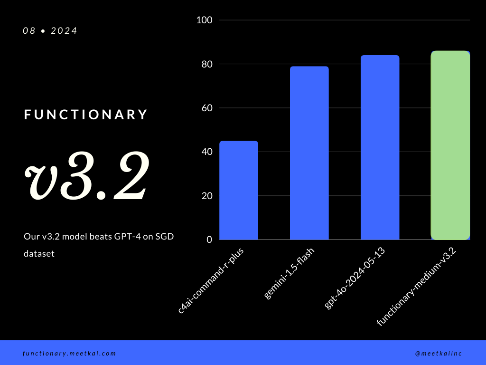

# Functionary

<a href="https://meetkai.com/">
  
</a>

Functionary is a language model that can interpret and execute functions/plugins.

The model determines when to execute functions, whether in parallel or serially, and can understand their outputs. It only triggers functions as needed. Function definitions are given as JSON Schema Objects, similar to OpenAI GPT function calls. 


Documentation and more examples: [functionary.meetkai.com](https://functionary.meetkai.com/)

<details>

  <summary>Changelog: (click to expand)</summary>

  + [2024-08-11] Our newest model ([meetkai/functionary-medium-v3.1](https://huggingface.co/meetkai/functionary-medium-v3.1)) is ranked 2nd in [Berkeley Function-Calling Leaderboard](https://gorilla.cs.berkeley.edu/leaderboard.html)
  + [2024/08/08] We release 128k-context length 70B-model: [meetkai/functionary-medium-v3.1](https://huggingface.co/meetkai/functionary-medium-v3.1) that are based on [meta-llama/Meta-Llama-3.1-70B-Instruct](https://huggingface.co/meta-llama/Meta-Llama-3.1-70B-Instruct)  
  + [2024/08/07] We release 2 128k-context length models that are based on [meta-llama/Meta-Llama-3.1-8B-Instruct](https://huggingface.co/meta-llama/Meta-Llama-3.1-8B-Instruct): 
     + [meetkai/functionary-small-v3.1](https://huggingface.co/meetkai/functionary-small-v3.1): **using Meta's original prompt template** as described in: [User-defined Custom tool calling](https://llama.meta.com/docs/model-cards-and-prompt-formats/llama3_1#user-defined-custom-tool-calling)
     + [meetkai/functionary-small-v3.2](https://huggingface.co/meetkai/functionary-small-v3.2): using **our own prompt template**. This model is **better** than [meetkai/functionary-small-v3.1](https://huggingface.co/meetkai/functionary-small-v3.1)
  + [2024/06/14] We release [meetkai/functionary-medium-v3.0](https://huggingface.co/meetkai/functionary-medium-v3.0) (based on [meta-llama/Meta-Llama-3-70B-Instruct](https://huggingface.co/meta-llama/Meta-Llama-3-70B-Instruct)) with better capability for function calling
  + [2024/05/17] We release [meetkai/functionary-small-v2.5](https://huggingface.co/meetkai/functionary-small-v2.5) with better capability for function calling and code interpreter compared with [functionary-small-v2.4](https://huggingface.co/meetkai/functionary-small-v2.4)
  + [2024/05/06] Streaming support for functionary v2 to v2.4 models is released in [llama-cpp-python](https://github.com/abetlen/llama-cpp-python)!
  + [2024/05/03] Added support for serverless vLLM deployment on [Modal.com](https://modal.com/)
  + [2024/04/27] New and improved grammar sampling! Ensures 100% accuracy in generating function names, prompt template and parameters.
  + [2024/04/02] We release [meetkai/functionary-small-v2.4](https://huggingface.co/meetkai/functionary-small-v2.4) and [meetkai/functionary-medium-v2.4](https://huggingface.co/meetkai/functionary-medium-v2.4)! The first functionary models with code-interpreter ability (by passing in `{type: "code_interpreter"}` in tools)!

</details>

### Setup

To install the required dependencies, run:

```shell
pip install -r requirements.txt
```

Now you can start a blazing fast [vLLM](https://vllm.readthedocs.io/en/latest/getting_started/installation.html) server.
[requirements](https://docs.vllm.ai/en/latest/getting_started/installation.html#requirements)

**Small Model:**
```shell
python3 server_vllm.py --model "meetkai/functionary-small-v3.2" --host 0.0.0.0 --max-model-len 8192
```

**Medium Model:**

Our medium models require: 4xA6000 or 2xA100 80GB to run, need to use: `tensor-parallel-size`

```shell
# vllm requires to run this first: https://github.com/vllm-project/vllm/issues/6152
export VLLM_WORKER_MULTIPROC_METHOD=spawn

python server_vllm.py --model "meetkai/functionary-medium-v3.1" --max-model-len 8192 --tensor-parallel-size 2
```


**Grammar Sampling**

We also offer our own function-calling grammar sampling feature which constrains the LLM's generation to always follow the prompt template, and ensures 100% accuracy for function name. The parameters are generated using the efficient [lm-format-enforcer](https://github.com/noamgat/lm-format-enforcer), which ensures that the parameters follow the schema of the tool called. To enable grammar sampling, run the vLLM server with the command-line argument <code>--enable-grammar-sampling</code>:

```shell
python3 server_vllm.py --model "meetkai/functionary-medium-v3.1" --max-model-len 8192 --tensor-parallel-size 2 --enable-grammar-sampling
```

Note:
- Grammar Sampling support is applicable only for the V2 and V3.0 models. There is no such support for V1 and V3.1 models.
- Our vLLM server supports the `tool_choice="required"` feature in OpenAI Chat Completion API exclusively **only when grammar sampling is enabled**.


**Text-Generation-Inference**

We also provide a service that performs inference on Functionary models using [Text-Generation-Inference](https://huggingface.co/docs/text-generation-inference/en/index) (TGI). Follow these steps to get started:

1. Install Docker following [their installation instructions](https://docs.docker.com/get-docker/).

2. Install the Docker SDK for Python

```shell
pip install docker
```

3. Start up the Functionary TGI server

At start-up, the Functionary TGI server tries to connect to an existing TGI endpoint. In this case, you can run the following:

```shell
python3 server_tgi.py --model <REMOTE_MODEL_ID_OR_LOCAL_MODEL_PATH> --endpoint <TGI_SERVICE_ENDPOINT>
```

If the TGI endpoint does not exist, the Functionary TGI server will start a new TGI endpoint container with the address provided in the `endpoint` CLI argument via the installed Docker Python SDK. Run the following commands for remote and local models respectively:

```shell
python3 server_tgi.py --model <REMOTE_MODEL_ID> --remote_model_save_folder <PATH_TO_SAVE_AND_CACHE_REMOTE_MODEL> --endpoint <TGI_SERVICE_ENDPOINT>
```

```shell
python3 server_tgi.py --model <LOCAL_MODEL_PATH> --endpoint <TGI_SERVICE_ENDPOINT>
```

4. Make either [OpenAI-compatible](#openai-compatible-usage) or [raw HTTP](#raw-usage) requests to the Functionary TGI server.


**Docker**

If you're having trouble with dependencies, and you have [nvidia-container-toolkit](https://docs.nvidia.com/datacenter/cloud-native/container-toolkit/latest/install-guide.html#setting-up-nvidia-container-toolkit), 
you can start your environment like this: 

```shell
sudo docker run --gpus all -it --ipc=host --name functionary -v ${PWD}/functionary_workspace:/workspace -p 8000:8000 nvcr.io/nvidia/pytorch:23.10-py3
```

### OpenAI Compatible Usage

```python
from openai import OpenAI

client = OpenAI(base_url="http://localhost:8000/v1", api_key="functionary")

client.chat.completions.create(
    model="meetkai/functionary-small-v3.2",
    messages=[{"role": "user",
            "content": "What is the weather for Istanbul?"}
    ],
    tools=[{
            "type": "function",
            "function": {
                "name": "get_current_weather",
                "description": "Get the current weather",
                "parameters": {
                    "type": "object",
                    "properties": {
                        "location": {
                            "type": "string",
                            "description": "The city and state, e.g. San Francisco, CA"
                        }
                    },
                    "required": ["location"]
                }
            }
        }],
    tool_choice="auto"
)
```


### Raw Usage:

<details>
  <summary>Details (click to expand)</summary>

```python
import requests

data = {
    'model': 'meetkai/functionary-small-v3.2', # model name here is the value of argument "--model" in deploying: server_vllm.py or server.py
    'messages': [
        {
            "role": "user",
            "content": "What is the weather for Istanbul?"
        }
    ],
    'tools':[ # For functionary-7b-v2 we use "tools"; for functionary-7b-v1.4 we use "functions" = [{"name": "get_current_weather", "description":..., "parameters": ....}]
        {
            "type": "function",
            "function": {
                "name": "get_current_weather",
                "description": "Get the current weather",
                "parameters": {
                    "type": "object",
                    "properties": {
                        "location": {
                            "type": "string",
                            "description": "The city and state, e.g. San Francisco, CA"
                        }
                    },
                    "required": ["location"]
                }
            }
        }
    ]
}

response = requests.post("http://127.0.0.1:8000/v1/chat/completions", json=data, headers={
    "Content-Type": "application/json",
    "Authorization": "Bearer xxxx"
})

# Print the response text
print(response.text)
```

</details>


## Models Available
| Model                                                                                | Description                                                                                                                         | VRAM FP16 |
|:-------------------------------------------------------------------------------------|:--------------------------------------------------------------------------------------------------------------------------------------|:------|
| [functionary-small-v3.2](https://huggingface.co/meetkai/functionary-small-v3.2) / [GGUF](https://huggingface.co/meetkai/functionary-small-v3.2-GGUF) | 128k context, code interpreter, using **our own prompt template** | 24GB |
| [functionary-medium-v3.1](https://huggingface.co/meetkai/functionary-medium-v3.1) / [GGUF](https://huggingface.co/meetkai/functionary-medium-v3.1-GGUF) | 128k context, code interpreter, using **original Meta's prompt template** | 160GB |
| [functionary-small-v3.1](https://huggingface.co/meetkai/functionary-small-v3.1) / [GGUF](https://huggingface.co/meetkai/functionary-small-v3.1-GGUF) | 128k context, code interpreter, using **original Meta's prompt template** | 24GB |
| [functionary-medium-v3.0](https://huggingface.co/meetkai/functionary-medium-v3.0) / [GGUF](https://huggingface.co/meetkai/functionary-medium-v3.0-GGUF) | 8k context, based on [meta-llama/Meta-Llama-3-70B-Instruct](https://huggingface.co/meta-llama/Meta-Llama-3-70B-Instruct) | 160GB |
| [functionary-small-v2.5](https://huggingface.co/meetkai/functionary-small-v2.5) / [GGUF](https://huggingface.co/meetkai/functionary-small-v2.5-GGUF) | 8k context, code interpreter | 24GB |
| [functionary-small-v2.4](https://huggingface.co/meetkai/functionary-small-v2.4) / [GGUF](https://huggingface.co/meetkai/functionary-small-v2.4-GGUF) | 8k context, code interpreter | 24GB |
| [functionary-medium-v2.4](https://huggingface.co/meetkai/functionary-medium-v2.4) / [GGUF](https://huggingface.co/meetkai/functionary-medium-v2.4-GGUF) | 8k context, code interpreter, better accuracy | 90GB |
| [functionary-small-v2.2](https://huggingface.co/meetkai/functionary-small-v2.2) / [GGUF](https://huggingface.co/meetkai/functionary-small-v2.2-GGUF) | 8k context | 24GB |
| [functionary-medium-v2.2](https://huggingface.co/meetkai/functionary-medium-v2.2) / [GGUF](https://huggingface.co/meetkai/functionary-medium-v2.2-GGUF) | 8k context| 90GB |
| [functionary-7b-v2.1](https://huggingface.co/meetkai/functionary-7b-v2.1) / [GGUF](https://huggingface.co/meetkai/functionary-7b-v2.1-GGUF)            | 8k context | 24GB |
| [functionary-7b-v2](https://huggingface.co/meetkai/functionary-7b-v2) / [GGUF](https://huggingface.co/meetkai/functionary-7b-v2-GGUF)                | Parallel function call support.   | 24GB |
| [functionary-7b-v1.4](https://huggingface.co/meetkai/functionary-7b-v1.4) / [GGUF](https://huggingface.co/meetkai/functionary-7b-v1.4-GGUF)            | 4k context, better accuracy (deprecated) | 24GB |
| [functionary-7b-v1.1](https://huggingface.co/meetkai/functionary-7b-v1.1)            | 4k context (deprecated)                                                                                                         | 24GB | 
| functionary-7b-v0.1            | 2k context (deprecated) Not recommended, use 2.1 onwards                                                                                                  | 24GB |

### Compatibility information

- v1 models are compatible with both OpenAI-python v0 and v1.
- v2 models are designed for compatibility with OpenAI-python v1.
  
The difference between OpenAI-python v0 and v1 you may refer to the official documentation [here](https://platform.openai.com/docs/api-reference/chat/create#chat-create-tools)

## The Differences Between Related Projects
| Feature/Project | [Functionary](https://github.com/MeetKai/functionary) | [NexusRaven](https://github.com/nexusflowai/NexusRaven) | [Gorilla](https://github.com/ShishirPatil/gorilla/tree/main/openfunctions) | [Glaive](https://huggingface.co/glaiveai/glaive-function-calling-v1)| [GPT-4-1106-preview](https://github.com/openai/openai-python) |
|---|---|---|---|---|---|
|Single Function Call | ✅ | ✅ | ✅ | ✅ | ✅ |
|Parallel Function Calls | ✅ | ✅ | ✅ | ❌ | ✅ |
|Following Up on Missing Function Arguments | ✅ | ❌ | ❌ | ❌ | ✅ |
|Multi-turn | ✅ | ❌ | ❌ | ✅ | ✅ |
|Generate Model Responses Grounded in Tools Execution Results | ✅ | ❌ | ❌ | ❌ | ✅ |
|Chit-Chat | ✅ | ❌ | ✅ | ✅ | ✅ |
|Code Interpreter | ✅ | ❌ | ❌ | ❌ | ✅ |

**You can find more details of the features in [here](features_desc.md)**

## Llama.cpp Inference

### Llama.cpp Inference using Huggingface Tokenizer
Example for inference using LLama-cpp-python can be found in: [llama_cpp_inference.py](functionary/examples/llama_cpp_inference.py). 

### Integration into Llama-cpp
Besides, functionary was also integrated into LLama-cpp-python, however the integration might not be **quickly updated**, so if there is something wrong or weird in the result, please use: [llama_cpp_inference.py](functionary/examples/llama_cpp_inference.py) instead. Currently, v2.5 hasn't been integrated, so if you are using **functionary-small-v2.5-GGUF**, please use: [llama_cpp_inference.py](functionary/examples/llama_cpp_inference.py)

Make sure that the latest version of [llama-cpp-python](https://github.com/abetlen/llama-cpp-python) is successully installed in your system. Functionary v2 is fully integrated into llama-cpp-python. You can perform inference using Functionary's GGUF models either via normal chat completion or through llama-cpp-python's OpenAI-compatible server which behaves similarly to ours.

The following is the sample code using normal chat completion:

```python
from llama_cpp import Llama
from llama_cpp.llama_tokenizer import LlamaHFTokenizer

# We should use HF AutoTokenizer instead of llama.cpp's tokenizer because we found that Llama.cpp's tokenizer doesn't give the same result as that from Huggingface. The reason might be in the training, we added new tokens to the tokenizer and Llama.cpp doesn't handle this successfully
llm = Llama.from_pretrained(
    repo_id="meetkai/functionary-small-v2.4-GGUF",
    filename="functionary-small-v2.4.Q4_0.gguf",
    chat_format="functionary-v2",
    tokenizer=LlamaHFTokenizer.from_pretrained("meetkai/functionary-small-v2.4-GGUF"),
    n_gpu_layers=-1
)

messages = [
    {"role": "user", "content": "what's the weather like in Hanoi?"}
]
tools = [ # For functionary-7b-v2 we use "tools"; for functionary-7b-v1.4 we use "functions" = [{"name": "get_current_weather", "description":..., "parameters": ....}]
    {
        "type": "function",
        "function": {
            "name": "get_current_weather",
            "description": "Get the current weather",
            "parameters": {
                "type": "object",
                "properties": {
                    "location": {
                        "type": "string",
                        "description": "The city and state, e.g., San Francisco, CA"
                    }
                },
                "required": ["location"]
            }
        }
    }
]

result = llm.create_chat_completion(
      messages = messages,
      tools=tools,
      tool_choice="auto",
)

print(result["choices"][0]["message"])
```
The output would be:
```python
{'role': 'assistant', 'content': None, 'tool_calls': [{'type': 'function', 'function': {'name': 'get_current_weather', 'arguments': '{\n  "location": "Hanoi"\n}'}}]}
```

For more details, please refer to the [Function Calling section](https://github.com/abetlen/llama-cpp-python?tab=readme-ov-file#function-calling) in llama-cpp-python. To use our Functionary GGUF models using llama-cpp-python's OpenAI-compatible server, please refer to [here](https://llama-cpp-python.readthedocs.io/en/latest/server/#function-calling) for more details and documentation.

**Note:**
- For Functionary in llama-cpp-python, the default system messages are added automatically during the API call. Therefore, there is no need to provide the default system messages in `messages`.
- Streaming feature for Functionary models in both the normal chat completion and in llama-cpp-python's OpenAI-compatible server is officially supported from v0.2.70 onwards.

</details>


## Call Real Python Function

To call the real python function, get the result and extract the result to respond, you can use [chatlab](https://github.com/rgbkrk/chatlab). The following example uses chatlab==0.16.0:

Please note that Chatlab currently doesn't support Parallel Function calls. This sample code is compatible only with Functionary Version 1.4 and may not work correctly with Functionary Version 2.0.
```python
from chatlab import Conversation
import openai
import os
openai.api_key = "functionary" # We just need to set this something other than None
os.environ['OPENAI_API_KEY'] = "functionary" # chatlab requires us to set this too
openai.api_base = "http://localhost:8000/v1"

# now provide the function with description
def get_car_price(car_name: str):
    """this function is used to get the price of the car given the name
    :param car_name: name of the car to get the price
    """
    car_price = {
        "tang": {"price": "$20000"},
        "song": {"price": "$25000"} 
    }
    for key in car_price:
        if key in car_name.lower():
            return {"price": car_price[key]}
    return {"price": "unknown"}

chat = Conversation(model="meetkai/functionary-7b-v2")
chat.register(get_car_price)  # register this function
chat.submit("what is the price of the car named Tang?") # submit user prompt

# print the flow
for message in chat.messages:
    role = message["role"].upper()
    if "function_call" in message:
        func_name = message["function_call"]["name"]
        func_param = message["function_call"]["arguments"]
        print(f"{role}: call function: {func_name}, arguments:{func_param}")
    else:
        content = message["content"]
        print(f"{role}: {content}")
```

The output will look like this:
```
USER: what is the price of the car named Tang?
ASSISTANT: call function: get_car_price, arguments:{
  "car_name": "Tang"
}
FUNCTION: {'price': {'price': '$20000'}}
ASSISTANT: The price of the car named Tang is $20,000.
```

## Serverless Deployment using Modal.com

Serverless deployment of Functionary models is supported via the *modal_server_vllm.py* script. After signing up and installing Modal, follow these steps to deploy our vLLM server on Modal:

1. **Create dev environment**

```shell Python
modal environment create dev
```
If you have a dev environment created already, there is no need to create another one. Just configure to it in the next step.

2. **Configure dev environment**

```shell Python
modal config set-environment dev
``` 


3. **Serve Functionary Model**
    
```shell Python
modal serve modal_server_vllm
```

4. **Deploy Runner**

```shell Python
modal deploy modal_server_vllm
```

## Quick Cloud Deployment

Use the `deploy_skypilot.py` script to deploy a Functionary model onto various clouds using Skypilot. Currently, we support the following clouds:
- Lambdalabs
- RunPod

### Get Started

1. Install Skypilot:

```bash
pip install skypilot[all]
```

2. Set up your cloud credentials by following the instructions [here](https://skypilot.readthedocs.io/en/latest/getting-started/installation.html#cloud-account-setup)

3. Run the following command to check the available arguments:
```bash
python deploy_skypilot.py --help
```

4. SkyPilot does not support stopping instances and opening ports for both Lambdalabs and RunPod currently.
For Lambdalabs, please expose the port for the server manually first [here](https://cloud.lambdalabs.com/firewall) before running `deploy_skypilot.py`.
For Runpod, please run `deploy_skypilot.py` twice. After the first command, check the [RunPod Dashboard](https://www.runpod.io/console/pods) for the instance created by Skypilot. Once the instance is created, expose the port for the server manually. Thereafter, ctrl-c the first command and run the command again.

5. To stop the cluster, run the following command and manually stop the instance on RunPod/Lambdalabs:
```bash
sky stop <cluster_name>
```


# Use Cases

Here are a few examples of how you can use this function calling system:

### Travel and Hospitality - Trip Planning
The function `plan_trip(destination: string, duration: int, interests: list)` can take user input such as "I want to plan a 7-day trip to Paris with a focus on art and culture" and generate an itinerary accordingly.

<details>
  <summary>Details (click to expand)</summary>

```python
client.chat.completions.create((
    model="meetkai/functionary-7b-v2",
    messages=[
        {"role": "user", "content": 'I want to plan a 7-day trip to Paris with a focus on art and culture'},
    ], 
    tools=[
        {
            "type": "function",
            "function": {
                "name": "plan_trip",
                "description": "Plan a trip based on user's interests",
                "parameters": {
                    "type": "object",
                    "properties": {
                        "destination": {
                            "type": "string",
                            "description": "The destination of the trip",
                        },
                        "duration": {
                            "type": "integer",
                            "description": "The duration of the trip in days",
                        },
                        "interests": {
                            "type": "array",
                            "items": {"type": "string"},
                            "description": "The interests based on which the trip will be planned",
                        },
                    },
                    "required": ["destination", "duration", "interests"],
                }
            }
        }    
    ]
)
```

Response will have: 

```json
{"role": "assistant", "content": null, "tool_calls": [{"type": "function", "function": {"name": "plan_trip", "arguments": '{\n  "destination": "Paris",\n  "duration": 7,\n  "interests": ["art", "culture"]\n}'}}]}
```

Then you need to call ```plan_trip``` function with provided arguments. 
If you would like a commentary from the model, then you'll call the model again with the response from the function, the model will write necessary commentary.

</details>


### Real Estate - Property Valuation
A function like estimate_property_value(property_details: dict) could allow users to input details about a property (such as location, size, number of rooms, etc.) and receive an estimated market value.

<details>
  <summary>Details (click to expand)</summary>

```python
client.chat.completions.create(
    model="meetkai/functionary-7b-v2",
    messages=[
        {
            "role": "user", 
            "content": 'What is the estimated value of a 3-bedroom house in San Francisco with 2000 sq ft area?'
        },
        {
            "role": "assistant", 
            "content": None, 
            "tool_calls": [
                {
                    "type": "function", 
                    "function": {
                        "name": "estimate_property_value", 
                        "arguments": '{\n  "property_details": {"location": "San Francisco", "size": 2000, "rooms": 3}\n}'
                    }
                }
            ]
        }
    ], 
    tools=[
        {
            "type": "function",
            "function": {
                "name": "estimate_property_value",
                "description": "Estimate the market value of a property",
                "parameters": {
                    "type": "object",
                    "properties": {
                        "property_details": {
                            "type": "object",
                            "properties": {
                                "location": {
                                    "type": "string",
                                    "description": "The location of the property"
                                },
                                "size": {
                                    "type": "integer",
                                    "description": "The size of the property in square feet"
                                },
                                "rooms": {
                                    "type": "integer",
                                    "description": "The number of rooms in the property"
                                }
                            },
                            "required": ["location", "size", "rooms"]
                        }
                    },
                    "required": ["property_details"]
                }
            }
        }
    ],
    tool_choice="auto"
)

```

Response will have: 

```json
{"role": "assistant", "content": null, "tool_calls": [{"type": "function", "function": {"name": "plan_trip", "arguments": '{\n  "destination": "Paris",\n  "duration": 7,\n  "interests": ["art", "culture"]\n}'}}]}
```

Then you need to call ```plan_trip``` function with provided arguments. 
If you would like a commentary from the model, then you'll call the model again with the response from the function, the model will write necessary commentary.

</details>


### Telecommunications - Customer Support
A function `parse_customer_complaint(complaint: {issue: string, frequency: string, duration: string})` could help in extracting structured information from a complex, narrative customer complaint, identifying the core issue and potential solutions. The `complaint` object could include properties such as `issue` (the main problem), `frequency` (how often the issue occurs), and `duration` (how long the issue has been occurring).

<details>
  <summary>Details (click to expand)</summary>

```python
client.chat.completions.create(
    model="meetkai/functionary-7b-v2",
    messages=[
        {"role": "user", "content": 'My internet has been disconnecting frequently for the past week'},
    ], 
    tools=[
        {
            "type": "function",
            "function": {
            "name": "parse_customer_complaint",
            "description": "Parse a customer complaint and identify the core issue",
            "parameters": {
                "type": "object",
                "properties": {
                    "complaint": {
                        "type": "object",
                        "properties": {
                            "issue": {
                                "type": "string",
                                "description": "The main problem",
                            },
                            "frequency": {
                                "type": "string",
                                "description": "How often the issue occurs",
                            },
                            "duration": {
                                "type": "string",
                                "description": "How long the issue has been occurring",
                            },
                        },
                        "required": ["issue", "frequency", "duration"],
                    },
                },
                "required": ["complaint"],
            }
        }
     }
    ],
    tool_choice="auto"
)
```

Response will have:

```json
{"role": "assistant", "content": null, "tool_calls": [{"type": "function", "function": {"name": "parse_customer_complaint", "arguments": '{\n  "complaint": {"issue": "internet disconnecting", "frequency": "frequently", "duration": "past week"}\n}'}}]}
```

Then you need to call parse_customer_complaint function with provided arguments.
If you would like a commentary from the model, then you'll call the model again with the response from the function, the model will write necessary commentary.

</details>


## How it Works?

We convert function definitions to a similar text to TypeScript definitions. 
Then we inject these definitions as system prompts. After that, we inject the default system prompt. 
Then we start the conversation messages. 

The prompt example can be found here: [V1](tests/prompt_test_v1.txt) (v1.4), [V2](tests/prompt_test_v2.txt) (v2, v2.1, v2.2, v2.4) and [V2.llama3](tests/prompt_test_v2.llama3.txt) (v2.5)


We don't change the logit probabilities to conform to a certain schema, but the model itself knows how to conform. This allows us to use existing tools and caching systems with ease.

## Evaluation

### Berkeley Function-Calling Leaderboard
We are ranked 2nd in the [Berkeley Function-Calling Leaderboard](https://gorilla.cs.berkeley.edu/leaderboard.html) (Last Updated: 2024-08-11)
| Model Name          | Function Calling  Accuracy (Name & Arguments) |
| :-------------------| ---------------------------: | 
| meetkai/functionary-medium-v3.1  |                       **88.88%**|
| GPT-4-1106-Preview (Prompt)  |                       88.53%|
| meetkai/functionary-small-v3.2  |                       82.82%|
| meetkai/functionary-small-v3.1  |                       82.53%|
| FireFunction-v2 (FC)  |                        78.82.47% |


### ToolSandbox
We also evaluate our models on [ToolSandbox](https://github.com/apple/ToolSandbox), this benchmark is much more difficult than **Berkeley Function-Calling Leaderboard**. This benchmark includes stateful tool execution, implicit state dependencies between tools, a built-in user simulator supporting on-policy conversational evaluation and a dynamic evaluation strategy for intermediate and final milestones over an arbitrary trajectory. The authors of this benchmark showed that there is a huge performance gap between open source models and proprietary models.

From our evaluation result, our models are comparable to best proprietary models and much better than other open source models.

| Model Name | Average similarity score |
| :----------| ------------------------: |
| GPT-4o-2024-05-13 |	73 |
| Claude-3-Opus-20240229 |	69.2 |
| **Functionary-medium-v3.1** | 68.87 |
| GPT-3.5-Turbo-0125 | 65.6 |
| GPT-4-0125-Preview	| 64.3 |
| Claude-3-Sonnet-20240229 |	63.8 |
| **Functionary-small-v3.1** | 63.13 |
| Gemini-1.5-Pro-001 | 60.4 |
| **Functionary-small-v3.2** | 58.56 |
| Claude-3-Haiku-20240307 | 54.9 |
| Gemini-1.0-Pro | 38.1 |	
| Hermes-2-Pro-Mistral-7B | 31.4 |
| Mistral-7B-Instruct-v0.3 | 29.8 |
| C4AI-Command-R-v01 | 26.2 |
| Gorilla-Openfunctions-v2 | 25.6 |
| C4AI-Command R+ | 24.7 |


### Function Prediction Evaluation
Evaluation function call prediction in SGD dataset. The accuracy metric measures the overall correctness of predicted function calls, including function name prediction and arguments extraction.



| Dataset       | Model Name          | Function Calling  Accuracy (Name & Arguments) |
| :-------------| :-------------------| ---------------------------: | 
| SGD | meetkai/functionary-medium-v3.1  |                       **88.11%**|
| SGD | gpt-4o-2024-05-13  |                       82.75%|
| SGD | gemini-1.5-flash  |                       79.64%|
| SGD | c4ai-command-r-plus  |                        45.66% |

</details>

## Training

See training [README](functionary/train/README.md)

## Roadmap

- [ ] OpenAPI specification based plugin support.
- [X] Fast inference server 
  - [X] [vLLM](https://github.com/vllm-project/vllm) 
  - [ ] [text-generation-inference](https://github.com/huggingface/text-generation-inference) ? See: [License Issue](https://github.com/huggingface/text-generation-inference/issues/726)
  - [X] Streaming Support
  - [X] function_call parameter to server
  - [X] Grammar Sampling to ensure 100% accuracy for function and parameter names
- [X] Parallel function calling support
- [X] Python function calling support (Automatic detection of type annotations and calling them automatically)
- [X] Real world usage examples, such as creating agents.
- [X] Train Mixtral based model
- [X] Code interpreter support
- **Please consider opening a PR for future requests**
