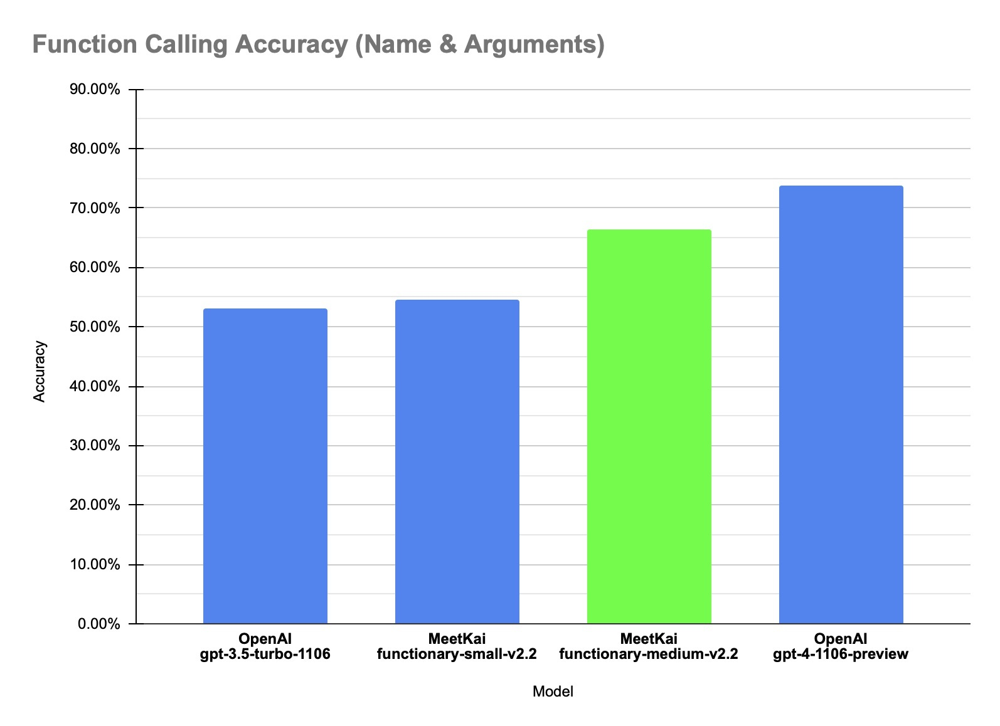

# Functionary

<a href="https://meetkai.com/">
  
</a>

Functionary is a language model that can interpret and execute functions/plugins.

The model determines when to execute a function and can understand its output. It only triggers functions as needed. Function definitions are given as JSON Schema Objects, similar to OpenAI GPT function calls.

### Setup

Make sure you have [PyTorch](https://pytorch.org/get-started/locally/) installed. Then to install the required dependencies, run:

```shell
pip install -r requirements.txt
```

Now you can start a blazing fast [vLLM](https://vllm.readthedocs.io/en/latest/getting_started/installation.html) server:

```shell
python3 server_vllm.py --model "meetkai/functionary-medium-v2.2" --host 0.0.0.0
```

### OpenAI Compatible Usage

```python
from openai import OpenAI

client = OpenAI(base_url="http://localhost:8000/v1", api_key="functionary")

client.chat.completions.create(
    model="meetkai/functionary-medium-v2.2",
    messages=[{"role": "user",
            "content": "What is the weather for Istanbul?"}
    ],
    tools=[{
            "type": "function",
            "function": {
                "name": "get_current_weather",
                "description": "Get the current weather",
                "parameters": {
                    "type": "object",
                    "properties": {
                        "location": {
                            "type": "string",
                            "description": "The city and state, e.g. San Francisco, CA"
                        }
                    },
                    "required": ["location"]
                }
            }
        }],
    tool_choice="auto"
)
```


### Raw Usage:

<details>
  <summary>Details (click to expand)</summary>

```python
import requests

data = {
    'model': 'meetkai/functionary-medium-v2.2', # model name here is the value of argument "--model" in deploying: server_vllm.py or server.py
    'messages': [
        {
            "role": "user",
            "content": "What is the weather for Istanbul?"
        }
    ],
    'tools':[ # For functionary-7b-v2 we use "tools"; for functionary-7b-v1.4 we use "functions" = [{"name": "get_current_weather", "description":..., "parameters": ....}]
        {
            "type": "function",
            "function": {
                "name": "get_current_weather",
                "description": "Get the current weather",
                "parameters": {
                    "type": "object",
                    "properties": {
                        "location": {
                            "type": "string",
                            "description": "The city and state, e.g. San Francisco, CA"
                        }
                    },
                    "required": ["location"]
                }
            }
        }
    ]
}

response = requests.post("http://127.0.0.1:8000/v1/chat/completions", json=data, headers={
    "Content-Type": "application/json",
    "Authorization": "Bearer xxxx"
})

# Print the response text
print(response.text)
```

</details>


If you're having trouble with dependencies, and you have [nvidia-container-toolkit](https://docs.nvidia.com/datacenter/cloud-native/container-toolkit/latest/install-guide.html#setting-up-nvidia-container-toolkit), 
you can start your environment like this: 

```shell
sudo docker run --gpus all -it --shm-size=8g --name functionary -v ${PWD}/functionary_workspace:/workspace -p 8000:8000 nvcr.io/nvidia/pytorch:22.12-py3
```

## Models Available
| Model                                                                                | Description                                                                                                                         |
|:-------------------------------------------------------------------------------------|:--------------------------------------------------------------------------------------------------------------------------------------|
| [functionary-small-v2.2](https://huggingface.co/meetkai/functionary-small-v2.2) | 8k context | 
| [functionary-medium-v2.2](https://huggingface.co/meetkai/functionary-medium-v2.2) | 8k context, better accuracy |
| [functionary-7b-v2.1](https://huggingface.co/meetkai/functionary-7b-v2.1)            | 8k context |
| [functionary-7b-v2](https://huggingface.co/meetkai/functionary-7b-v2) / [GGUF](https://huggingface.co/meetkai/functionary-7b-v2-GGUF)                | Parallel function call support.   |
| [functionary-7b-v1.4](https://huggingface.co/meetkai/functionary-7b-v1.4) / [GGUF](https://huggingface.co/meetkai/functionary-7b-v1.4-GGUF)            | 4k context, better accuracy (deprecated) |
| [functionary-7b-v1.1](https://huggingface.co/meetkai/functionary-7b-v1.1)            | 4k context (deprecated)                                                                                                         | 
| functionary-7b-v0.1            | 2k context Not recommended, use 2.1 (deprecated)                                                                                                         |


Compatibility information:

- v1 models are compatible with both OpenAI-python v0 and v1.
- v2 models are designed for compatibility with OpenAI-python v1.
  
The difference between OpenAI-python v0 and v1 you may refer to the official documentation [here](https://platform.openai.com/docs/api-reference/chat/create#chat-create-tools)

## Llama_cpp Inference

<details>
  <summary>Details (click to expand)</summary>

Make sure that [llama-cpp-python](https://github.com/abetlen/llama-cpp-python) is successully installed in your system. The following is the sample code:

```python
from llama_cpp import Llama
from functionary.prompt_template import get_prompt_template_from_tokenizer
from transformers import AutoTokenizer

tools = [ # For functionary-7b-v2 we use "tools"; for functionary-7b-v1.4 we use "functions" = [{"name": "get_current_weather", "description":..., "parameters": ....}]
    {
        "type": "function",
        "function": {
            "name": "get_current_weather",
            "description": "Get the current weather",
            "parameters": {
                "type": "object",
                "properties": {
                    "location": {
                        "type": "string",
                        "description": "The city and state, e.g., San Francisco, CA"
                    }
                },
                "required": ["location"]
            }
        }
    }
]


# You can download gguf files from https://huggingface.co/meetkai/functionary-7b-v2-GGUF/tree/main
llm = Llama(model_path="PATH_TO_GGUF_FILE", n_ctx=4096, n_gpu_layers=-1)
messages = [
    {"role": "user", "content": "what's the weather like in Hanoi?"}
]

# Create tokenizer from HF. 
# We found that the tokenizer from llama_cpp is not compatible with tokenizer from HF that we trained
# The reason might be we added new tokens to the original tokenizer
# So we will use tokenizer from HuggingFace
tokenizer = AutoTokenizer.from_pretrained("meetkai/functionary-7b-v2", legacy=True)
# prompt_template will be used for creating the prompt
prompt_template = get_prompt_template_from_tokenizer(tokenizer)

# Before inference, we need to add an empty assistant (message without content or function_call)
messages.append({"role": "assistant"})

# Create the prompt to use for inference
prompt_str = prompt_template.get_prompt_from_messages(messages, tools)
token_ids = tokenizer.encode(prompt_str)

gen_tokens = []
# Get list of stop_tokens 
stop_token_ids = [tokenizer.encode(token)[-1] for token in prompt_template.get_stop_tokens_for_generation()]
print("stop_token_ids: ", stop_token_ids)

# We use function generate (instead of __call__) so we can pass in list of token_ids
for token_id in llm.generate(token_ids, temp=0):
    if token_id in stop_token_ids:
        break
    gen_tokens.append(token_id)

llm_output = tokenizer.decode(gen_tokens)

# parse the message from llm_output
result = prompt_template.parse_assistant_response(llm_output)
print(result)
```
The output would be:
```python
{'role': 'assistant', 'content': None, 'tool_calls': [{'type': 'function', 'function': {'name': 'get_current_weather', 'arguments': '{\n  "location": "Hanoi"\n}'}}]}
```
**Note: we should use the tokenizer from Huggingface to convert prompt into token_ids instead of using the tokenizer from LLama_cpp because we found that tokenizer from LLama_cpp doesn't give the same result as that from Huggingface. The reason might be in the training, we added new tokens to the tokenizer and LLama_Cpp doesn't handle this succesfully**

</details>

## Call Real Python Function

To call the real python function, get the result and extract the result to respond, you can use [chatlab](https://github.com/rgbkrk/chatlab). The following example uses chatlab==0.16.0:

Please note that Chatlab currently doesn't support Parallel Function calls. This sample code is compatible only with Functionary Version 1.4 and may not work correctly with Functionary Version 2.0.
```python
from chatlab import Conversation
import openai
import os
openai.api_key = "functionary" # We just need to set this something other than None
os.environ['OPENAI_API_KEY'] = "functionary" # chatlab requires us to set this too
openai.api_base = "http://localhost:8000/v1"

# now provide the function with description
def get_car_price(car_name: str):
    """this function is used to get the price of the car given the name
    :param car_name: name of the car to get the price
    """
    car_price = {
        "tang": {"price": "$20000"},
        "song": {"price": "$25000"} 
    }
    for key in car_price:
        if key in car_name.lower():
            return {"price": car_price[key]}
    return {"price": "unknown"}

chat = Conversation(model="meetkai/functionary-7b-v2")
chat.register(get_car_price)  # register this function
chat.submit("what is the price of the car named Tang?") # submit user prompt

# print the flow
for message in chat.messages:
    role = message["role"].upper()
    if "function_call" in message:
        func_name = message["function_call"]["name"]
        func_param = message["function_call"]["arguments"]
        print(f"{role}: call function: {func_name}, arguments:{func_param}")
    else:
        content = message["content"]
        print(f"{role}: {content}")
```

The output will look like this:
```
USER: what is the price of the car named Tang?
ASSISTANT: call function: get_car_price, arguments:{
  "car_name": "Tang"
}
FUNCTION: {'price': {'price': '$20000'}}
ASSISTANT: The price of the car named Tang is $20,000.
```

# Use Cases

Here are a few examples of how you can use this function calling system:

### Travel and Hospitality - Trip Planning
The function `plan_trip(destination: string, duration: int, interests: list)` can take user input such as "I want to plan a 7-day trip to Paris with a focus on art and culture" and generate an itinerary accordingly.

<details>
  <summary>Details (click to expand)</summary>

```python
client.chat.completions.create((
    model="meetkai/functionary-7b-v2",
    messages=[
        {"role": "user", "content": 'I want to plan a 7-day trip to Paris with a focus on art and culture'},
    ], 
    tools=[
        {
            "type": "function",
            "function": {
                "name": "plan_trip",
                "description": "Plan a trip based on user's interests",
                "parameters": {
                    "type": "object",
                    "properties": {
                        "destination": {
                            "type": "string",
                            "description": "The destination of the trip",
                        },
                        "duration": {
                            "type": "integer",
                            "description": "The duration of the trip in days",
                        },
                        "interests": {
                            "type": "array",
                            "items": {"type": "string"},
                            "description": "The interests based on which the trip will be planned",
                        },
                    },
                    "required": ["destination", "duration", "interests"],
                }
            }
        }    
    ]
)
```

Response will have: 

```json
{"role": "assistant", "content": null, "tool_calls": [{"type": "function", "function": {"name": "plan_trip", "arguments": '{\n  "destination": "Paris",\n  "duration": 7,\n  "interests": ["art", "culture"]\n}'}}]}
```

Then you need to call ```plan_trip``` function with provided arguments. 
If you would like a commentary from the model, then you'll call the model again with the response from the function, the model will write necessary commentary.

</details>


### Real Estate - Property Valuation
A function like estimate_property_value(property_details: dict) could allow users to input details about a property (such as location, size, number of rooms, etc.) and receive an estimated market value.

<details>
  <summary>Details (click to expand)</summary>

```python
client.chat.completions.create(
    model="meetkai/functionary-7b-v2",
    messages=[
        {
            "role": "user", 
            "content": 'What is the estimated value of a 3-bedroom house in San Francisco with 2000 sq ft area?'
        },
        {
            "role": "assistant", 
            "content": None, 
            "tool_calls": [
                {
                    "type": "function", 
                    "function": {
                        "name": "estimate_property_value", 
                        "arguments": '{\n  "property_details": {"location": "San Francisco", "size": 2000, "rooms": 3}\n}'
                    }
                }
            ]
        }
    ], 
    tools=[
        {
            "type": "function",
            "function": {
                "name": "estimate_property_value",
                "description": "Estimate the market value of a property",
                "parameters": {
                    "type": "object",
                    "properties": {
                        "property_details": {
                            "type": "object",
                            "properties": {
                                "location": {
                                    "type": "string",
                                    "description": "The location of the property"
                                },
                                "size": {
                                    "type": "integer",
                                    "description": "The size of the property in square feet"
                                },
                                "rooms": {
                                    "type": "integer",
                                    "description": "The number of rooms in the property"
                                }
                            },
                            "required": ["location", "size", "rooms"]
                        }
                    },
                    "required": ["property_details"]
                }
            }
        }
    ],
    tool_choice="auto"
)

```

Response will have: 

```json
{"role": "assistant", "content": null, "tool_calls": [{"type": "function", "function": {"name": "plan_trip", "arguments": '{\n  "destination": "Paris",\n  "duration": 7,\n  "interests": ["art", "culture"]\n}'}}]}
```

Then you need to call ```plan_trip``` function with provided arguments. 
If you would like a commentary from the model, then you'll call the model again with the response from the function, the model will write necessary commentary.

</details>


### Telecommunications - Customer Support
A function `parse_customer_complaint(complaint: {issue: string, frequency: string, duration: string})` could help in extracting structured information from a complex, narrative customer complaint, identifying the core issue and potential solutions. The `complaint` object could include properties such as `issue` (the main problem), `frequency` (how often the issue occurs), and `duration` (how long the issue has been occurring).

<details>
  <summary>Details (click to expand)</summary>

```python
client.chat.completions.create(
    model="meetkai/functionary-7b-v2",
    messages=[
        {"role": "user", "content": 'My internet has been disconnecting frequently for the past week'},
    ], 
    tools=[
        {
            "type": "function",
            "function": {
            "name": "parse_customer_complaint",
            "description": "Parse a customer complaint and identify the core issue",
            "parameters": {
                "type": "object",
                "properties": {
                    "complaint": {
                        "type": "object",
                        "properties": {
                            "issue": {
                                "type": "string",
                                "description": "The main problem",
                            },
                            "frequency": {
                                "type": "string",
                                "description": "How often the issue occurs",
                            },
                            "duration": {
                                "type": "string",
                                "description": "How long the issue has been occurring",
                            },
                        },
                        "required": ["issue", "frequency", "duration"],
                    },
                },
                "required": ["complaint"],
            }
        }
     }
    ],
    tool_choice="auto"
)
```

Response will have:

```json
{"role": "assistant", "content": null, "tool_calls": [{"type": "function", "function": {"name": "parse_customer_complaint", "arguments": '{\n  "complaint": {"issue": "internet disconnecting", "frequency": "frequently", "duration": "past week"}\n}'}}]}
```

Then you need to call parse_customer_complaint function with provided arguments.
If you would like a commentary from the model, then you'll call the model again with the response from the function, the model will write necessary commentary.

</details>


## Training

We use standard HuggingFace Trainer. When calculating the loss, we only calculate the loss on assistant outputs and assistant function calls. Not on function responses and function definitions

We use the similar hyperparameters as its used in LLama 2 [paper](https://arxiv.org/abs/2307.09288). 
Except we use bigger weight decay (0.3 instead of 0.1) and warmup of 0.03, to reduce overfitting as we sample 2x of the function calling example conversations. But ablation study is required.

**Hyperparameters**:

- Batch size: 64
- Learning rate: 2e-5
- Epochs: 2
- Max length: 4096
- Weight decay: 0.3

More on training: [README.md](functionary/train/README.md) 

## How it Works?

We convert function definitions to a similar text to TypeScript definitions. 
Then we inject these definitions as system prompts. After that, we inject the default system prompt. 
Then we start the conversation messages. 

The prompt example can be found here: [V1](https://github.com/MeetKai/functionary/blob/readme_v2/tests/prompt_test_v1.txt) and [V2](https://github.com/MeetKai/functionary/blob/readme_v2/tests/prompt_test_v2.txt)


We don't change the logit probabilities to conform to a certain schema, but the model itself knows how to conform. This allows us to use existing tools and caching systems with ease.

## Evaluation

### Function Prediction Evaluation
Evaluation function call prediction in our in-house dataset. The accuracy metric measures the overall correctness of predicted function calls, including function name prediction and arguments extraction.



| Dataset       | Model Name          | Function Calling  Accuracy (Name & Arguments) |
| :-------------| :-------------------| ---------------------------: | 
| In-house data | MeetKai-functionary-small-v2.2  |                       0.546|
| In-house data | MeetKai-functionary-medium-v2.2  |                       **0.664**|
| In-house data | OpenAI-gpt-3.5-turbo-1106  |                        0.531 |
| In-house data | OpenAI-gpt-4-1106-preview  |                        **0.737** |

</details>

## Dataset Preparation

Dataset preparation process consists of several steps:

1. **Function Definitions Conversion:** We begin by selecting multiple function definitions and converting them into TypeScript definitions. This approach benefits from the model's prior exposure to TypeScript tokens during the pretraining phase. [See how we do it](https://github.com/musabgultekin/functionary/blob/17a86de9b06acaedd0afab212717205c0484a218/schema.py#L54) Also see [Microsoft TypeChat](https://github.com/microsoft/TypeChat/blob/d2f2de9ca37ef9adeb108d5fc60703b72fec0a22/site/src/blog/introducing-typechat.md#just-add-types) . Typescript definition files can be seen [here](https://github.com/search?q=namespace+path%3A*.d.ts&type=code), we use the same format with a couple of changes (e.g removing `declare` and `interface`, and always using curly braces because all function parameters are expected to generate a JSON object).

2. **Human Prompts Generation:** We then create human prompts that incorporate the converted TypeScript function definitions. 

3. **Function Calls Generation:** Following the generation of human prompts, we proceed to generate corresponding function calls.

4. **Function Answers Generation:** Once function calls have been generated, we derive the outputs of these function calls would produce.

5. **Function Answers Interpretation:** After procuring function answers, we generate language model answers for the function response. So the model knows how to interpret the function response.

6. **Merging and Training:** We combine all the generated elements (prompts, function calls, function answers, and their interpretations) using a custom formatting. This consolidated dataset is then used for the model's training.

*Note: Llama 2 70b / Falcon 180B is capable of doing all synthetic data generation.*


## Roadmap

- [ ] Train [Llama 2](https://arxiv.org/abs/2307.09288) 13B model too, with 2x more data.
- [ ] OpenAPI specification based plugin support.
- [X] Fast inference server 
  - [X] [vLLM](https://github.com/vllm-project/vllm) 
  - [ ] [text-generation-inference](https://github.com/huggingface/text-generation-inference) ? See: [License Issue](https://github.com/huggingface/text-generation-inference/issues/726)
  - [X] Streaming Support
  - [ ] function_call parameter to server
- [X] Python function calling support (Automatic detection of type annotations and calling them automatically)
- [X] Real world usage examples, such as creating agents.
- **Please consider opening a PR for future requests**
